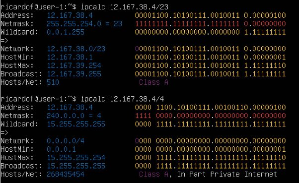
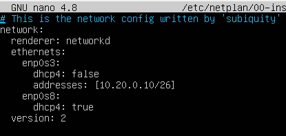

Part 1. Инструмент **ipcalc**

1. Сети и маски

\1) Адрес сети 192\.167\.38\.54/13 :

\2)

255\.255.255.0 в префиксную и двоичную запись: Префиксная запись: /24

Двоичная запись: 11111111.11111111.11111111.00000000

/15 в обычную и двоичную запись:

Обычная запись: 255.254.0.0

Двоичная запись: 11111111.11111110.00000000.00000000

11111111\.11111111.11111111.11110000 в обычную и префиксную запись: Обычная запись: 255.255.255.240

Префиксная запись: /28

3) Минимальный и максимальный хост в сети 12.167.38.4 при масках: /8, 11111111.11111111.00000000.00000000, 255.255.254.0 и /4

2. localhost

Адреса localhost находятся в диапазоне 127.0.0.0/8, то есть от 127.0.0.0 до 127.255.255.255.

194\.34.23.100: Нет

127\.0.0.2: Да

127\.1.0.1: Да

128\.0.0.1: Нет

3. Диапазоны и сегменты сетей

\1) Частные:

10\.0.0.0 - 10.255.255.255 (10.0.0.0/8) 172.16.0.0 - 172.31.255.255 (172.16.0.0/12) 192.168.0.0 - 192.168.255.255 (192.168.0.0/16) Остальные публичные

10\.0.0.45 - частный

134\.43.0.2 - публичный

192\.168.4.2 - частный

172\.20.250.4 -частный

172\.0.2.1 - частный

192\.172.0.1 - публичный

172\.68.0.2 - частный

172\.16.255.255 - частный 10.10.10.10 - частный 192.169.168.1 - публичный

\2)

Минимальный хост: 10.10.0.1

Максимальный хост: 10.10.63.254

Возможные: 10.10.0.2, 10.10.10.10, 10.10.1.255, 10.10.0.0/18. Невозможные: 10.0.0.1, 10.10.100.1

Part 2. Статическая маршрутизация между двумя машинами.

С помощью команды ip a посмотр существующих сетевых интерфейсов.

Опиши сетевой интерфейс, соответствующий внутренней сети, на обеих машинах и задать следующие адреса и маски: ws1 - *192.168.100.10*, маска */16*, ws2 - *172.24.116.8*, маска */12*.

Команда netplan apply для перезапуска сервиса сети.

1. Добавление статического маршрута вручную

2. Добавление статического маршрута с сохранением

Part 3. Утилита **iperf3**

1. **Скорость соединения**

8 Mbps=1 MB/s

100 MB/s=100×8×1024 Kbps=819200 Kbps 1 Gbps=1024 Mbps

2. Утилита iperf3

Part 4. Сетевой экран

1. Утилита iptables

2. Утилита nmap

Part 5. Статическая маршрутизация сети

1. Настройка адресов машин

w11:

w21:

w22:

r1:

r2:

пропингуй ws22 с ws21. Аналогично пропингуй r1 с ws11.

2. Включение переадресации IP-адресов

-

3. Установка маршрута по-умолчанию w11:

w21:

w22:

w11 c r2:

4. Добавление статических маршрутов

Вызвать ip r и показать таблицы с маршрутами на обоих роутерах.

Запусти команды на ws11:

ip r list 10.10.0.0/[маска сети] и ip r list 0.0.0.0/0

Маршрут подбирается по таблице марштрутизаторов. Если маршрут выбран успешно то он будет передан. Если не успешно - пакет не будет передан. Если несколько совпадений - то для переадсресации будет выбран маршрут с самой длинной маской.

5. Построение списка маршрутизаторов

6. Использование протокола ICMP при маршрутизации

Part 6. Динамическая настройка IP с помощью **DHCP**

Машину ws21 перезагрузить при помощи reboot и через ip a показать, что она получила адрес. Также пропинговать ws22 с ws21.

Укажи MAC адрес у ws11, для этого в etc/netplan/00-installer-config.yaml надо добавить строки: macaddress: 10:10:10:10:10:BA, dhcp4: true.

Для r1 настрой аналогично r2, но сделай выдачу адресов с жесткой привязкой к MAC-адресу (ws11). Проведи аналогичные тесты.

ip до обновления и после.

Запроси с ws21 обновление ip адреса.

Пинг с обновленным ip у машины ws21

Part 7. **NAT**

Добавить в фаервол, на r2 следующие правила:

Удаление правил в таблице filter - iptables -F

Удаление правил в таблице "NAT" - iptables -F -t nat

Отбрасывать все маршрутизируемые пакеты - iptables --policy FORWARD DROP

Проверь соединение между ws22 и r1 командой ping.

*При запуске файла с этими правилами, ws22 не должна «пинговаться» с r1.*

4) Разрешить маршрутизацию всех пакетов протокола ICMP.

Проверь соединение между ws22 и r1 командой ping.

При запуске файла с этими правилами, ws22 должна «пинговаться» с r1.

5) Включи SNAT, а именно маскирование всех локальных ip из локальной сети, находящейся за r2
5) Включи DNAT на 8080 порт машины r2 и добавить к веб-серверу Apache, запущенному на ws22, доступ извне сети.

Проверь соединение по TCP для SNAT: для этого с ws22 подключиться к серверу

Проверь соединение по TCP для DNAT: для этого с r1 подключиться к серверу Apache на ws22 командой telnet (обращаться по адресу r2 и порту 8080).

Part 8. Дополнительно. Знакомство с SSH Tunnels

Запусти веб-сервер **Apache** на ws22 только на localhost (то есть в файле */etc/apache2/ports.conf* измени строку Listen 80 на Listen localhost:80).

Воспользоваться *Local TCP forwarding* с ws21 до ws22, чтобы получить доступ к веб-серверу на ws22 с ws21 Воспользоваться *Remote TCP forwarding* c ws11 до ws22, чтобы получить доступ к веб-серверу на ws22 с ws11

